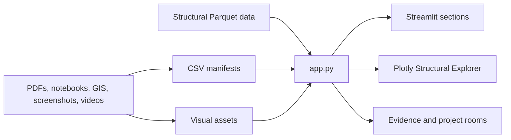
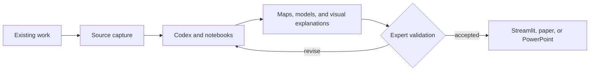

# Portfolio Architecture

## Purpose

This repository turns research artifacts into a public portfolio, interactive
scientific views, and presentation-ready material. The architecture must keep
three things visible:

1. where evidence comes from;
2. how code and AI transform it;
3. where human validation is still required.

## Current Runtime



The current application is intentionally simple:

- `app.py` owns routing, content definitions, data loading, styling, and page
  rendering.
- `data/` contains structured inventories, roadmaps, and project status.
- `assets/` contains copied evidence, topic visuals, and structural datasets.
- Plotly provides the meaningful scientific 3D interaction.
- Streamlit provides deployment, controls, media rendering, and navigation.

This is functional, but `app.py` is now large enough that page rendering,
content, and data access should be separated during the next maintenance pass.

## Visitor-Facing Research Flow



Validation is part of the main path. It is not an optional final disclaimer.

## Target Application Structure

```text
app.py
components/
    system_map.py
    visual_lab.py
content/
    topics.py
pages/
    overview.py
    structural_explorer.py
    topic_room.py
services/
    data.py
data/
    project_status.csv
visuals/
    p5/
```

The target is not a framework rewrite. The target is a smaller entry point,
cached data access, isolated page renderers, and reusable interactive
components.

## Visualization Runtime

Processing remains the creative-coding reference. Browser-facing motion uses
p5.js because it follows the Processing model while running inside a Streamlit
HTML component.

Use motion to communicate:

- evidence moving through a workflow;
- nodes organizing into a graph;
- uncertainty and validation gates;
- feedback returning to an earlier stage;
- delivery progress across project stages.

Do not use motion as unrelated decoration.

## Data Boundaries

- Public deployment must use committed, public-safe assets.
- Local `C:\Users\gargi\...` paths are evidence references, not deployment
  dependencies.
- Large scientific data should load only on pages that require it.
- Credentials, private data, and controlled research data must never enter this
  repository.

## Next Refactor

1. Move cached CSV and Parquet loading into `services/data.py`.
2. Move topic dictionaries into `content/topics.py`.
3. Move each major section renderer into `pages/`.
4. Keep `app.py` responsible for configuration, navigation, and dispatch.
5. Profile startup before and after lazy-loading structural data.
